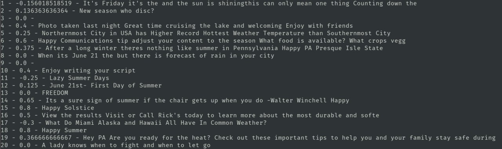
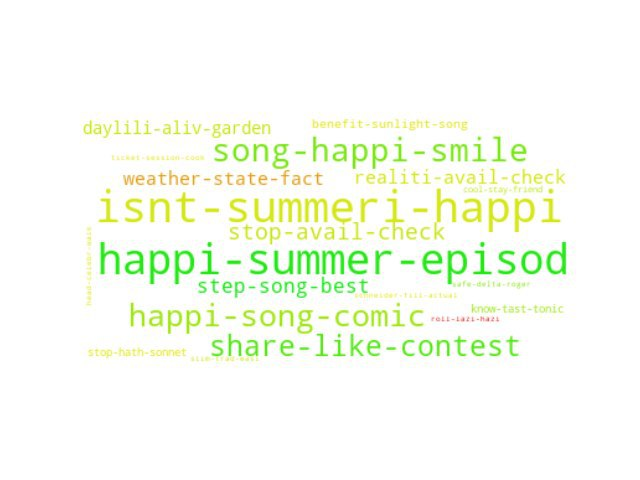

# Real Time Twitter Analysis and visualization using Kafka

In this project we analyze hashtags related tweets using **Python** and **Kafka** stream message platform to connect the tweets retrieve procces and the tweets analysis and visualizations process, our analysys proccess it could be easily extended but for project propose we develop topics, sentiment and word-frequency analysis.

## Requirements

To run this project we need:

- [Python2.7](https://www.python.org/downloads/): Nice programming lang 😎.
- [Docker](https://www.docker.com/): Worldwide container platform 🐳.
- [Docker Compose](https://docs.docker.com/compose/): Docker utility to manage docker containers clusters.

Aditionaly we strongly recommend use an isolated environment for python dependencies, like:

- [virtualenv - virtualwrapper](https://virtualenv.pypa.io/en/latest/): Light-weight python environment manager.
- [Anaconda - Conda](https://anaconda.org/): Multipropose env manager for advance env-package managment.

## Run instructions

To run this project we just need to follow the next steps:

1. Install the dependencies listed in ```twitter-to-kafka/requirements.txt``` using ```pip```
<br>hint: ```pip install -r twitter-to-kafka/requirements.txt```
2. Create and run the docker-kafka architecture running in the terminal:<br> ```$> docker-compose up```
3. Run ```python twitter-to-kafka/twitter-to-kafka.py```
4. Insert your hashtag to analyse for example ```$> Inserte su hashtag: #NBA```
5. Enjoy the show! (The wordcloud lasts in screen for 10 seconds, and then it refreshes automatically every 100 tweets)


## Overview

The project consists of a Docker-based architecture running Kafka-Zookeeper and a Python script that let us use the Twitter API. we've developed a Producer/Consumer process, where every tweet is delivered from the Producer to a Kafka topic, where the Consumer can retrieve it and process/analyze it. <br>
In this case, our process consists of a preprocessing cleaning and tokenization of each tweet and a sentiment analysis. Every amount of tweets-sentiment score, we go to a topic analysis process, in which we retrieve the most important topics, and the percentage indicating how much a tweet corresponds to a topic. Finally, we create a word cloud, showing how many times a topic was named and how good/bad was its sentiment score (from green to red). Our project wants to show the difference between hashtags, and how controversial hashtags (e.g. #Trump) has more variety of colors, not like "peaceful" hashtags (e.g. #YogaDay2019).

## Dataset

Basically, our dataset is Twitter's tweets related by a hashtag(#) collected from the Twitter API. We use only the content of every message received, deleting all undesired letters, symbols, and others.

## Methods

For this project, we used Docker, Python(2.7) and Kafka. We chose to develop all the code following a Producer/Consumer scheme, extensible to a lot of multi-threading consumers that could repeat the task. The principal problems were related to the techniques used. First, there is a lot of sentiment analysis tools, but they can be very imprecise, and this can be reflected in our word cloud. Also, for topic analysis, it was difficult to choose good representants of the tweets, principally because people don't give context in their tweets, only comment a single thing, so this was difficult to represent. Finally, the colors of the word cloud were very difficult to adapt, in order to create a kind of transition between red and green, principally because the data were not as good as expected.

## Results

The results obtained show that any hashtag can be monitored in a simple way. We are very happy with the graphics because you can see real topics going on, and the colors are mostly related (looking at the printed tweets and its sentiment scores).

<center></center>
<center>#FirstDayofSummer analysis and clasification by sentiment score</center>
<br>
<center></center>
<center>#FirstDayofSummer word cloud</center>


## Conclusion

There were many things that could be improved, principally improving the code to get results that are useful in a certain way. Also, the technologies involved (principally Kafka and Docker) were not used at its maximum, ignoring a lot of cool features that would let us scale up the processing power to handle an XLarge amount of data.

By the other hand this is the first approach to generate analysis to a massive real-time data source that we made with good results and we believe in the potential of this Docker-based architecture and the power to extend this scripts with more analysis and new features as a database or preprocessing scripts to catalog and push to Kafka again in a different topic.

## Contributors

**Cristóbal Loyola**<br>
**Jorge Gutiérrez**<br>
**Benjamín Zamora**<br>

---
<center>June 2019 - U. de  Chile</center>

<br>
<br>
<br>
